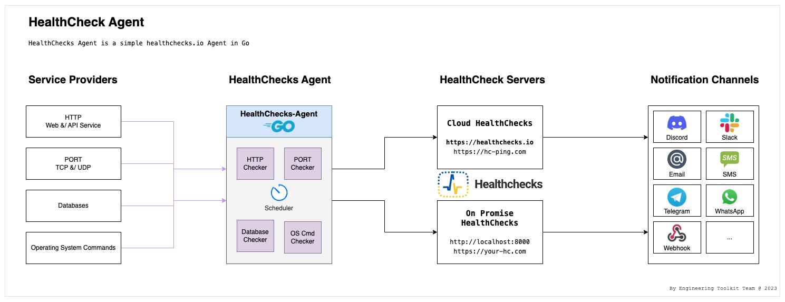

# HealthChecks Agent

HealthChecks Agent is a simple healthchecks.io Agent in Go.

# Architecture



### Development

1. Clone

```shell
$ git clone https://github.com/engineering-toolkit/healthchecks-agent.git
```

2. Setup

```
a. copy `conf/config.sample.yaml` to `conf/config.yaml`

b. copy `conf/test-data/config.sample.yaml` to `conf/test-data/config.yaml`
```

3. Development

GO Native :
```shell
$ cd healthchecks-agent
$ go run main.go version
$ go run main.go scheduler start-blocking
```

With Air ([cosmtrek/air](https://github.com/cosmtrek/air)) :
```shell
$ cd healthchecks-agent
$ air version
$ air scheduler start-blocking
```

4. Build

```shell
$ cd healthchecks-agent
$ go build -o ./hc-agent
$ ./hc-agent version
$ ./hc-agent scheduler start-blocking
```

5. Distribution [to-do]

```shell
$ cd healthchecks-agent
$ sh dist.sh
```
